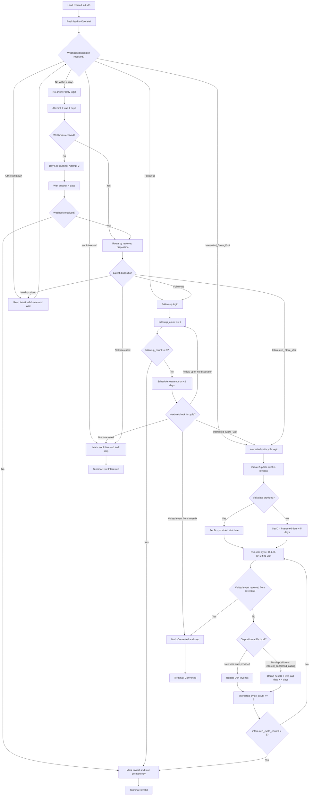
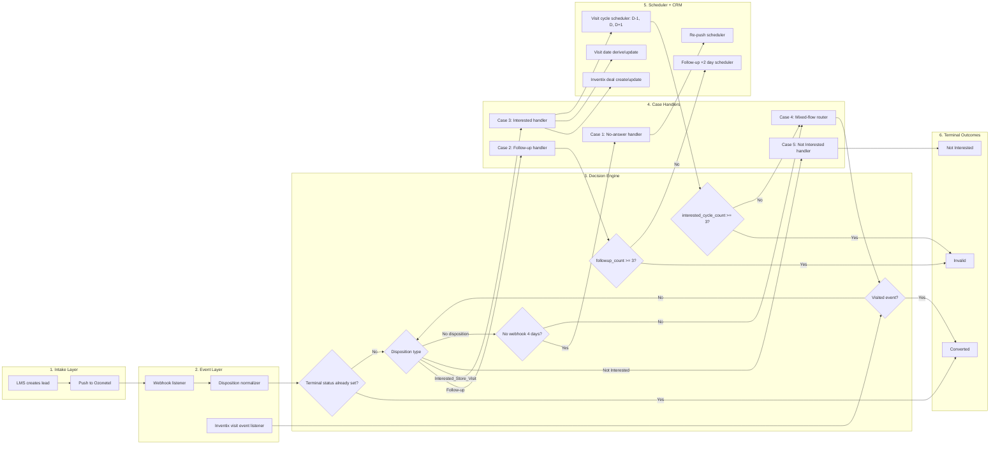

# Digital Lead Call Handling Flow (LMS <-> Ozonetel <-> Inventix)

This document defines the complete lifecycle for digital lead calling and closure handling across all cases.

## System Entities

- **LMS**: Source system and lead state owner.
- **Ozonetel**: Calling system that sends webhook dispositions.
- **Inventix (CRM)**: Deal and store-visit event system for Interested leads.

---

## Master Decision Flow Diagram



---

## Complete Flow Wireframe



### Wireframe Reading Guide

- **Intake Layer**: lead enters from LMS and is pushed to Ozonetel.
- **Event Layer**: webhooks and Inventix visit events are captured and normalized.
- **Decision Engine**: terminal checks, disposition branching, and counter limits are evaluated.
- **Case Handlers**: each of the 5 cases executes its own rules.
- **Scheduler + CRM**: manages retries, follow-up timing, visit-cycle calls, and Inventix updates.
- **Terminal Outcomes**: end states are `Converted`, `Invalid`, or `Not Interested`.

---

## Global Rules (Apply to All Cases)

- **Conversion has highest priority**: if Inventix sends a visited event, mark **Converted** and stop all future calls.
- **Not Interested is immediate closure**: mark **Not Interested** and stop all calling.
- **Invalid is terminal**: once Invalid, ignore all future webhooks and never re-push.
- **Latest disposition drives active path**, but counters from previous paths remain preserved.
- **Ignore late events for terminal leads** (`Invalid`, `Converted`, `Not Interested`).

---

## Case 1: Call Not Answered (No Webhook from Ozonetel)

### Trigger
- Lead pushed from LMS to Ozonetel, but no webhook/disposition is received.

### Flow
1. **Attempt 1**
   - Push lead to Ozonetel.
   - Wait **4 days** for webhook.
2. **Attempt 2**
   - If still no webhook, re-push on **Day 5**.
   - Wait another **4 days**.
3. **Closure**
   - If still no webhook, mark lead as **Invalid**.

### Limits
- Max attempts: **2**
- Wait per attempt: **4 days**
- Total lifecycle before closure: **8-9 days**

---

## Case 2: Only Follow-up Disposition

### Meaning
Customer answered, but outcome needs reattempt (call later, unclear audio, disconnect, etc.).

### Trigger
- First webhook within initial window is **Follow-up**.

### Flow
1. Start follow-up cycle and increment `followup_count`.
2. Reattempt every **2 days**.
3. Repeat up to **3 follow-up cycles**.
4. If unresolved (Follow-up again or no disposition), mark **Invalid** after limit.

### Limits
- `followup_count` max: **3**
- Wait per cycle: **2 days**
- Total follow-up window: **6 days**

---

## Case 3: Only Interested Disposition

### Trigger
- Webhook disposition is **Interested_Store_Visit**.

### Visit Date Rules
- If customer gives a visit date: use that as `D`.
- If missing: derive `D = interested disposition date + 5 days`.

### CRM Action
- Create/update deal in **Inventix** with lead details and visit date `D`.

### Visit Calling Cycle
- **D-1**: reminder call.
- **D**: confirmation call.
- **D+1**: missed-visit follow-up call (only if visit not happened).

### Next Visit Date Rules (post D+1 when no visit)
- If customer provides new date: set new `D` to provided date.
- If no disposition or `interest_confirmed_calling`: derive new `D = (D+1 call date) + 4 days`.

### Re-iteration Limit
- Allow up to **3 interested cycles total** (first schedule cycle + max 2 more cycles).
- If no visit after limit and only soft/no outcome, mark **Invalid**.

### Conversion
- Only Inventix **visited event** marks conversion.
- `interest_confirmed_calling` is not conversion.

---

## Case 4: Mixed Follow-up + Interested

### Principle
- Switch active flow based on **latest disposition**.
- Preserve both counters:
  - `followup_count`
  - `interested_cycle_count`
- Whichever limit hits first closes lead as **Invalid** (unless converted earlier).

### Decision Framework
- Only Follow-up -> run Case 2.
- Only Interested -> run Case 3.
- Follow-up -> Interested -> switch to Interested flow.
- Interested -> Follow-up -> continue Follow-up flow with existing counters.
- Visit event anytime -> mark **Converted** immediately.

### Limit Rules
- If `followup_count >= 3` -> Invalid.
- If `interested_cycle_count >= 3` -> Invalid.

---

## Case 5: Not Interested

### Trigger
- Webhook disposition is **Not Interested**.

### Action
- Immediately mark lead as **Not Interested**.
- Stop all future calls.
- Ignore any future webhooks.

---

## Counter & State Model

- `followup_count`: increments on each completed Follow-up cycle.
- `interested_cycle_count`: increments on each completed Interested visit cycle.
- `latest_disposition`: last valid disposition from webhook.
- `terminal_status`: one of `Converted`, `Invalid`, `Not Interested`.

---

## Execution Pseudocode

```python
if lead.terminal_status in ["Converted", "Invalid", "Not Interested"]:
    ignore_future_events()
elif inventix_event == "visited":
    mark_converted()
    stop_all_calls()
elif webhook_disposition == "Not Interested":
    mark_not_interested()
    stop_all_calls()
elif webhook_disposition == "Interested_Store_Visit":
    run_interested_flow()
elif webhook_disposition == "Follow-up":
    run_followup_flow()
elif no_webhook_within_4_days and lead.initial_attempts < 2:
    retry_no_answer_flow()
elif followup_count >= 3 or interested_cycle_count >= 3:
    mark_invalid()
    stop_all_calls()
else:
    wait_for_next_event_or_schedule()
```

---

## Operational Notes

- Once any terminal status is reached, never re-enter calling.
- Date arithmetic must use a consistent timezone across LMS, Ozonetel, and Inventix.
- Inventix is source of truth for visit completion.
- Visit date updates in Inventix must overwrite previous scheduled date.

---

## Manual Test Cases (Complete)

Use these test cases for UAT/manual QA.  
For each case, validate:
- Lead status transitions in LMS
- Calls pushed to Ozonetel on expected dates
- Counter increments (`followup_count`, `interested_cycle_count`)
- Deal/visit date behavior in Inventix
- Terminal-state behavior (no further processing)

### A. Common Preconditions

- A valid lead exists in LMS and is eligible for calling.
- LMS -> Ozonetel push integration is active.
- Webhook receiver is active and can receive/update dispositions.
- Inventix event listener is active for visit events.
- Test environment has deterministic date/timezone.

### B. Case 1 - No Answer / No Webhook

1. **TC-NA-01: No webhook after first 4 days**
   - Steps: Push lead on Day 0, do not send webhook until Day 4 ends.
   - Expected: Lead enters no-answer retry path; scheduled for Day 5 re-push.

2. **TC-NA-02: No webhook after second attempt**
   - Steps: Continue from TC-NA-01; re-push on Day 5; no webhook for next 4 days.
   - Expected: Lead marked `Invalid` by Day 8-9; excluded permanently.

3. **TC-NA-03: Webhook arrives during first wait window**
   - Steps: Push on Day 0; send Follow-up webhook on Day 2.
   - Expected: No second no-answer re-push; flow routes to Follow-up logic.

4. **TC-NA-04: Webhook arrives during second wait window**
   - Steps: No webhook in first 4 days; re-push Day 5; send Interested webhook Day 7.
   - Expected: Lead does not become invalid; switches to Interested logic.

5. **TC-NA-05: Late webhook after Invalid**
   - Steps: Complete TC-NA-02 until Invalid; then send any webhook.
   - Expected: Webhook ignored; lead remains Invalid; no new call scheduled.

### C. Case 2 - Follow-up Only

6. **TC-FU-01: Follow-up disposition starts cycle**
   - Steps: Send Follow-up webhook within first 4 days.
   - Expected: `followup_count = 1`; reattempt scheduled at +2 days.

7. **TC-FU-02: Three consecutive follow-up cycles**
   - Steps: Provide Follow-up webhook in each cycle window.
   - Expected: At `followup_count = 3`, lead marked `Invalid`.

8. **TC-FU-03: Follow-up then no disposition in cycle**
   - Steps: First Follow-up webhook received; then no webhook in next +2-day cycle.
   - Expected: Cycle counted as unresolved; next follow-up cycle triggered until limit.

9. **TC-FU-04: Follow-up then Not Interested**
   - Steps: Follow-up starts; on next attempt send Not Interested webhook.
   - Expected: Immediate `Not Interested` closure; no more follow-up attempts.

10. **TC-FU-05: Follow-up then Interested**
    - Steps: Follow-up starts; next webhook is Interested_Store_Visit.
    - Expected: Switch to Interested flow; existing `followup_count` preserved.

11. **TC-FU-06: Late webhook after follow-up-based Invalid**
    - Steps: Lead reaches Invalid from follow-up limit; send Follow-up/Interested webhook.
    - Expected: Ignored due to terminal state.

### D. Case 3 - Interested Only

12. **TC-IN-01: Interested with explicit visit date**
    - Steps: Send Interested webhook with customer visit date `D`.
    - Expected: Inventix deal created/updated with same `D`.

13. **TC-IN-02: Interested without visit date (derived date)**
    - Steps: Send Interested webhook without visit date on date `X`.
    - Expected: System sets `D = X + 5 days` and stores in Inventix.

14. **TC-IN-03: D-1 reminder call scheduling**
    - Steps: Set visit date `D`; observe scheduler.
    - Expected: Call pushed on `D-1`.

15. **TC-IN-04: D-day confirmation scheduling**
    - Steps: Continue TC-IN-03.
    - Expected: Call pushed on `D`.

16. **TC-IN-05: D+1 call only when no visit**
    - Steps: For date `D`, do not send visited event.
    - Expected: Call pushed on `D+1`.

17. **TC-IN-06: Visited event on D or earlier**
    - Steps: Send Inventix `visited` event at/after D-1.
    - Expected: Lead becomes `Converted`; all pending future calls cancelled.

18. **TC-IN-07: interest_confirmed_calling at D-1/D**
    - Steps: Send `interest_confirmed_calling` webhook.
    - Expected: No conversion; flow continues to visit validation path.

19. **TC-IN-08: No disposition at D+1 -> derive next date**
    - Steps: No visit, and no disposition after D+1 call date `Y`.
    - Expected: New visit date `D2 = Y + 4 days` stored in Inventix.

20. **TC-IN-09: New visit date provided after D+1**
    - Steps: On post D+1 call, customer gives explicit next visit date.
    - Expected: Inventix visit date overwritten with provided new date.

21. **TC-IN-10: Interested cycle count limit**
    - Steps: Complete 3 interested cycles without visited event.
    - Expected: Lead marked `Invalid`.

22. **TC-IN-11: Late visited event after Invalid**
    - Steps: Reach Invalid by interested-cycle limit; then send visited event.
    - Expected: Event ignored; status remains Invalid.

### E. Case 4 - Mixed Follow-up + Interested

23. **TC-MX-01: Follow-up -> Interested switch**
    - Steps: Two follow-ups, then Interested webhook.
    - Expected: Flow switches to Interested; `followup_count` retained.

24. **TC-MX-02: Interested -> Follow-up switch**
    - Steps: Start Interested flow; later receive Follow-up webhook.
    - Expected: Active path becomes Follow-up; interested counters remain stored.

25. **TC-MX-03: Follow-up limit reached first**
    - Steps: Mixed dispositions but `followup_count` reaches 3 before interested limit.
    - Expected: Lead marked Invalid immediately.

26. **TC-MX-04: Interested limit reached first**
    - Steps: Mixed dispositions but `interested_cycle_count` reaches 3 first.
    - Expected: Lead marked Invalid immediately.

27. **TC-MX-05: Conversion in middle of mixed flow**
    - Steps: Start mixed flow; send Inventix visited event before any limit.
    - Expected: Lead marked Converted; all counters/cycles stop.

28. **TC-MX-06: Mixed flow with no disposition windows**
    - Steps: Alternate follow-up/interested responses with some empty windows.
    - Expected: System keeps counters accurate and follows latest disposition.

### F. Case 5 - Not Interested

29. **TC-NI-01: Not Interested as first disposition**
    - Steps: Send Not Interested webhook after initial push.
    - Expected: Immediate terminal status `Not Interested`; no further calls.

30. **TC-NI-02: Not Interested during follow-up flow**
    - Steps: Follow-up started; then send Not Interested.
    - Expected: Follow-up flow terminated immediately.

31. **TC-NI-03: Not Interested during interested flow**
    - Steps: Interested flow active; then send Not Interested.
    - Expected: Interested cycle terminated; status set Not Interested.

32. **TC-NI-04: Any future webhook after Not Interested**
    - Steps: After Not Interested closure, send Follow-up/Interested webhook.
    - Expected: Event ignored.

### G. Counter, State, and Priority Validation

33. **TC-ST-01: Terminal state immutability**
    - Steps: Move lead to each terminal state one by one in separate runs.
    - Expected: No state change allowed afterwards from any webhook.

34. **TC-ST-02: Priority - Visited over non-terminal active flow**
    - Steps: Active follow-up/interested flow; send visited event.
    - Expected: Converted immediately, regardless of pending retries.

35. **TC-ST-03: Priority - Not Interested immediate close**
    - Steps: Active mixed flow; send Not Interested.
    - Expected: Immediate Not Interested closure, no pending schedule execution.

36. **TC-ST-04: Invalid precedence after limit reached**
    - Steps: Reach configured limit exactly, then verify scheduler run.
    - Expected: Invalid set and scheduler does not enqueue more calls.

37. **TC-ST-05: Latest disposition routing**
    - Steps: Send sequential dispositions (Follow-up -> Interested -> Follow-up).
    - Expected: Current path follows latest disposition while preserving counters.

### H. Date and Scheduler Validation

38. **TC-DT-01: Day-boundary handling**
    - Steps: Trigger events near midnight boundary.
    - Expected: 2-day/4-day logic follows configured timezone, not server local drift.

39. **TC-DT-02: Weekend/holiday date continuity**
    - Steps: Put D-1/D/D+1 across weekend.
    - Expected: Scheduler still executes by day offsets unless business calendar logic exists.

40. **TC-DT-03: Derived date formula for Interested first date**
    - Steps: Interested on date X without date provided.
    - Expected: `D = X + 5 days`.

41. **TC-DT-04: Derived date formula after D+1 no disposition**
    - Steps: D+1 call at date Y with no outcome.
    - Expected: New `D = Y + 4 days`.

42. **TC-DT-05: Date overwrite behavior**
    - Steps: Set D1, then provide new D2.
    - Expected: Inventix stores only latest D2 for future cycle.

### I. Integration and Data Quality Validation

43. **TC-INT-01: Duplicate webhook delivery (idempotency)**
    - Steps: Send same webhook payload twice.
    - Expected: Counters and schedules are not double-incremented.

44. **TC-INT-02: Out-of-order webhook delivery**
    - Steps: Deliver older event after newer one.
    - Expected: System resolves by event timestamp/order policy; no counter corruption.

45. **TC-INT-03: Unknown disposition mapping**
    - Steps: Send unmapped disposition value.
    - Expected: Event safely ignored or logged; lead remains in valid non-terminal flow.

46. **TC-INT-04: Missing mandatory webhook fields**
    - Steps: Send webhook without lead ID/disposition.
    - Expected: Validation failure; no state mutation.

47. **TC-INT-05: Inventix event without matching lead**
    - Steps: Send visited event with invalid lead reference.
    - Expected: Event rejected/logged; no accidental conversion.

48. **TC-INT-06: LMS re-push failure handling**
    - Steps: Simulate re-push API failure.
    - Expected: Retry/alert behavior triggers; no inconsistent status transition.

### J. Regression/End-to-End Scenario Packs

49. **TC-E2E-01: Pure no-answer to Invalid**
    - Expected path: Case 1 end-to-end.

50. **TC-E2E-02: Pure follow-up to Invalid**
    - Expected path: Case 2 end-to-end.

51. **TC-E2E-03: Interested to Converted (visit happens)**
    - Expected path: Case 3 success end-to-end.

52. **TC-E2E-04: Interested to Invalid (no visit across limits)**
    - Expected path: Case 3 failure end-to-end.

53. **TC-E2E-05: Mixed flow to Converted**
    - Expected path: Case 4 with visit event before limits.

54. **TC-E2E-06: Mixed flow to Invalid by follow-up limit**
    - Expected path: Case 4 closure by follow-up counter.

55. **TC-E2E-07: Mixed flow to Invalid by interested limit**
    - Expected path: Case 4 closure by interested counter.

56. **TC-E2E-08: Immediate Not Interested closure**
    - Expected path: Case 5 end-to-end.

### K. Sign-off Checklist

- All 56 manual test cases executed and evidence captured.
- No terminal state allows re-entry into calling.
- Counter increments are exact and non-duplicated.
- Date derivations (`+5`, `+4`, `+2`, `+4-day wait`) validated in timezone.
- Inventix visited event always forces conversion when lead is non-terminal.
- Unknown/late/duplicate events do not corrupt state.
