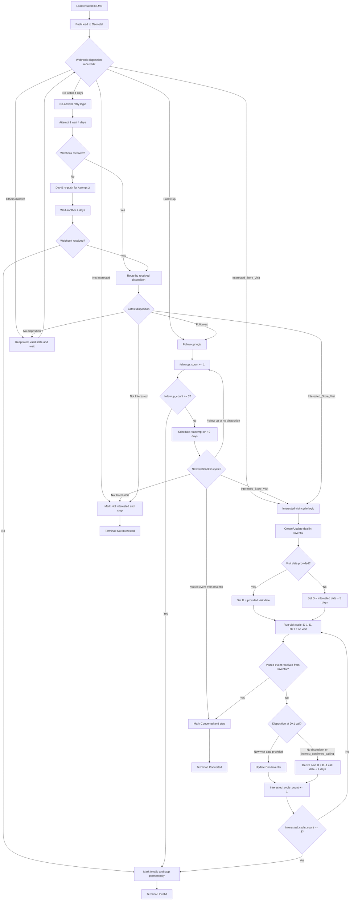
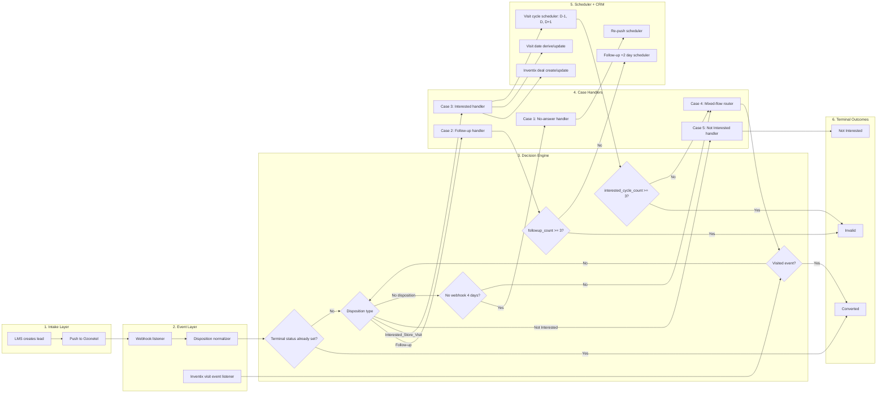

# Digital Lead Call Handling Flow (LMS <-> Ozonetel <-> Inventix)

This document defines the complete lifecycle for digital lead calling and closure handling across all cases.

## System Entities

- **LMS**: Source system and lead state owner.
- **Ozonetel**: Calling system that sends webhook dispositions.
- **Inventix (CRM)**: Deal and store-visit event system for Interested leads.

---

## Master Decision Flow Diagram



---

## Complete Flow Wireframe



### Wireframe Reading Guide

- **Intake Layer**: lead enters from LMS and is pushed to Ozonetel.
- **Event Layer**: webhooks and Inventix visit events are captured and normalized.
- **Decision Engine**: terminal checks, disposition branching, and counter limits are evaluated.
- **Case Handlers**: each of the 5 cases executes its own rules.
- **Scheduler + CRM**: manages retries, follow-up timing, visit-cycle calls, and Inventix updates.
- **Terminal Outcomes**: end states are `Converted`, `Invalid`, or `Not Interested`.

---

## Global Rules (Apply to All Cases)

- **Conversion has highest priority**: if Inventix sends a visited event, mark **Converted** and stop all future calls.
- **Not Interested is immediate closure**: mark **Not Interested** and stop all calling.
- **Invalid is terminal**: once Invalid, ignore all future webhooks and never re-push.
- **Latest disposition drives active path**, but counters from previous paths remain preserved.
- **Ignore late events for terminal leads** (`Invalid`, `Converted`, `Not Interested`).

---

## Case 1: Call Not Answered (No Webhook from Ozonetel)

### Trigger
- Lead pushed from LMS to Ozonetel, but no webhook/disposition is received.

### Flow
1. **Attempt 1**
   - Push lead to Ozonetel.
   - Wait **4 days** for webhook.
2. **Attempt 2**
   - If still no webhook, re-push on **Day 5**.
   - Wait another **4 days**.
3. **Closure**
   - If still no webhook, mark lead as **Invalid**.

### Limits
- Max attempts: **2**
- Wait per attempt: **4 days**
- Total lifecycle before closure: **8-9 days**

---

## Case 2: Only Follow-up Disposition

### Meaning
Customer answered, but outcome needs reattempt (call later, unclear audio, disconnect, etc.).

### Trigger
- First webhook within initial window is **Follow-up**.

### Flow
1. Start follow-up cycle and increment `followup_count`.
2. Reattempt every **2 days**.
3. Repeat up to **3 follow-up cycles**.
4. If unresolved (Follow-up again or no disposition), mark **Invalid** after limit.

### Limits
- `followup_count` max: **3**
- Wait per cycle: **2 days**
- Total follow-up window: **6 days**

---

## Case 3: Only Interested Disposition

### Trigger
- Webhook disposition is **Interested_Store_Visit**.

### Visit Date Rules
- If customer gives a visit date: use that as `D`.
- If missing: derive `D = interested disposition date + 5 days`.

### CRM Action
- Create/update deal in **Inventix** with lead details and visit date `D`.

### Visit Calling Cycle
- **D-1**: reminder call.
- **D**: confirmation call.
- **D+1**: missed-visit follow-up call (only if visit not happened).

### Next Visit Date Rules (post D+1 when no visit)
- If customer provides new date: set new `D` to provided date.
- If no disposition or `interest_confirmed_calling`: derive new `D = (D+1 call date) + 4 days`.

### Re-iteration Limit
- Allow up to **3 interested cycles total** (first schedule cycle + max 2 more cycles).
- If no visit after limit and only soft/no outcome, mark **Invalid**.

### Conversion
- Only Inventix **visited event** marks conversion.
- `interest_confirmed_calling` is not conversion.

---

## Case 4: Mixed Follow-up + Interested

### Principle
- Switch active flow based on **latest disposition**.
- Preserve both counters:
  - `followup_count`
  - `interested_cycle_count`
- Whichever limit hits first closes lead as **Invalid** (unless converted earlier).

### Decision Framework
- Only Follow-up -> run Case 2.
- Only Interested -> run Case 3.
- Follow-up -> Interested -> switch to Interested flow.
- Interested -> Follow-up -> continue Follow-up flow with existing counters.
- Visit event anytime -> mark **Converted** immediately.

### Limit Rules
- If `followup_count >= 3` -> Invalid.
- If `interested_cycle_count >= 3` -> Invalid.

---

## Case 5: Not Interested

### Trigger
- Webhook disposition is **Not Interested**.

### Action
- Immediately mark lead as **Not Interested**.
- Stop all future calls.
- Ignore any future webhooks.

---

## Counter & State Model

- `followup_count`: increments on each completed Follow-up cycle.
- `interested_cycle_count`: increments on each completed Interested visit cycle.
- `latest_disposition`: last valid disposition from webhook.
- `terminal_status`: one of `Converted`, `Invalid`, `Not Interested`.

---

## Execution Pseudocode

```python
if lead.terminal_status in ["Converted", "Invalid", "Not Interested"]:
    ignore_future_events()
elif inventix_event == "visited":
    mark_converted()
    stop_all_calls()
elif webhook_disposition == "Not Interested":
    mark_not_interested()
    stop_all_calls()
elif webhook_disposition == "Interested_Store_Visit":
    run_interested_flow()
elif webhook_disposition == "Follow-up":
    run_followup_flow()
elif no_webhook_within_4_days and lead.initial_attempts < 2:
    retry_no_answer_flow()
elif followup_count >= 3 or interested_cycle_count >= 3:
    mark_invalid()
    stop_all_calls()
else:
    wait_for_next_event_or_schedule()
```

---

## Operational Notes

- Once any terminal status is reached, never re-enter calling.
- Date arithmetic must use a consistent timezone across LMS, Ozonetel, and Inventix.
- Inventix is source of truth for visit completion.
- Visit date updates in Inventix must overwrite previous scheduled date.
